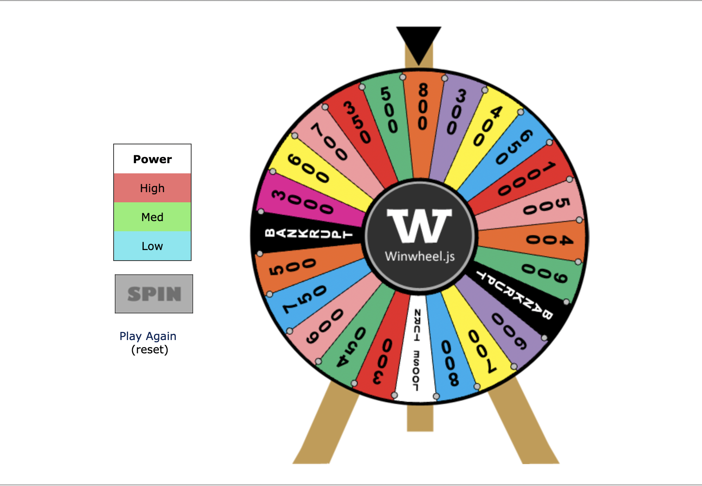

# Quiz8

 ## Imaging Tech

 **Draw a wheel of fortune.**  
 
 Since planning to choose Pacita Abad Wheels of fortune as a target of the main project, we think about how to use animation on the wheels. Drawing a wheel of fortune game may be helpful because we want to make the small circles in the different big wheels revolving in different speeds. The fortune wheel example helps to figure out how to achieve  user input and use random values to drive animation.

- Image 1

Define low speed, spin hasn’t start yet

- Image 2

Define high speed, spin has finished and the result is 800.

## Coding Tech

**The spinning effect is achieved by updating the rotation of the canvas element using CSS in the rotate() function, and then continuously updating the rotation angle in the frame() function.**

 1. Rotate() function is responsible for rotating the canvas element according to the current angle (ang). It's called after every frame update to adjust the rotation of the wheel.

 2. Frame() function handles the animation frame by frame. It calculates the new angle and updates the rotation accordingly. It also handles acceleration and deceleration to achieve a spinning effect.

*[*This is the link of the example*] (https://stackoverflow.com/questions/33850201/how-to-draw-a-wheel-of-fortune)*

- Image 3

This is a part of the code we need.
